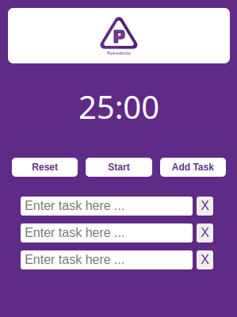

 

  

  <h1 align="center"><a href="https://github.com/MahdiTa97/pomodoros">Pomodoros </a></h1>

<h3 align="center">Pomodoros is a Pomodoro-timer chrome-extension</h3>
   

  
  

     
    ·
    <a href="https://github.com/MahdiTa97/pomodoros/issues">Report Bug</a>
    ·
    <a href="https://github.com/MahdiTa97/pomodoros/issues">Request Feature</a>
  

## Installation

 clone/download the project, unzip, open `chrome://extensions` url and turn on developer mode from top left and then click; on `Load Unpacked` and select the extracted folder for use

## Screenshots

